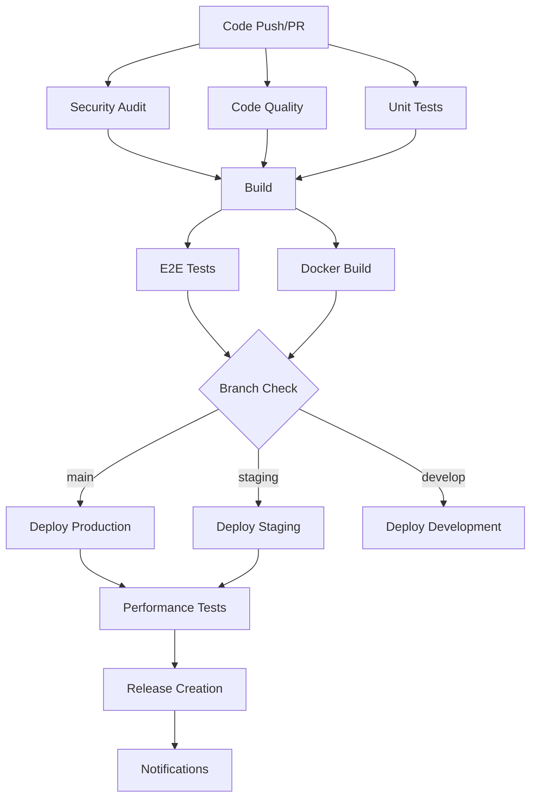

# CI/CD Pipeline and Deployment Guide

## Overview

This document provides comprehensive guidance for the CI/CD pipeline and deployment infrastructure for the Decentralized Video Chat Application.

## 🚀 CI/CD Architecture

### Pipeline Overview



### GitHub Actions Workflows

#### 1. Main CI/CD Pipeline (`.github/workflows/ci.yml`)

**Triggers:**
- Push to `main`, `staging`, `develop` branches
- Pull requests to `main`, `staging`
- Manual trigger via `workflow_dispatch`

**Jobs:**
1. **Security Audit** - npm audit, Trivy scanning, SARIF upload
2. **Code Quality** - ESLint, TypeScript checking, Prettier
3. **Tests** - Unit, integration tests across Node.js 16, 18, 20
4. **E2E Tests** - Playwright tests with artifact upload
5. **Build** - Docker image building and pushing to GHCR
6. **Deploy** - Cloud provider deployments (Vercel/Railway)
7. **Performance Tests** - Lighthouse CI, load testing

#### 2. Pull Request Checks (`.github/workflows/pull-request.yml`)

**Features:**
- PR size labeling and auto-reviewer assignment
- Fast feedback with lint and type checking
- Test coverage reporting with comments
- Build verification and bundle size checks
- Smoke tests and security scanning
- Docker build testing
- Comprehensive PR status reporting

#### 3. Release Pipeline (`.github/workflows/release.yml`)

**Triggers:**
- Git tag push (`v*`)
- Manual release via workflow dispatch

**Features:**
- Release artifact building
- Final security scans
- Production deployment with blue-green strategy
- GitHub release creation with changelog
- Slack notifications and monitoring updates

#### 4. Dependency Management (`.github/workflows/dependency-update.yml`)

**Features:**
- Weekly dependency audits
- Automated dependency updates
- Container security scanning
- Automated PR creation for updates

### Dependabot Configuration (`.github/dependabot.yml`)

**Update Schedule:**
- **npm packages**: Weekly on Mondays
- **Docker images**: Weekly on Tuesdays  
- **GitHub Actions**: Weekly on Wednesdays

**Grouping Strategy:**
- Development dependencies grouped together
- React ecosystem dependencies grouped
- Build tool dependencies grouped

## 🏗️ Deployment Strategies

### Cloud Provider Deployments

#### Frontend - Vercel
```yaml
- name: Deploy Frontend to Vercel
  uses: amondnet/vercel-action@v25
  with:
    vercel-token: ${{ secrets.VERCEL_TOKEN }}
    vercel-org-id: ${{ secrets.VERCEL_ORG_ID }}
    vercel-project-id: ${{ secrets.VERCEL_PROJECT_ID }}
```

**Configuration:**
- Automatic deployments on main branch
- Preview deployments for pull requests
- Edge caching and CDN optimization
- Environment-specific configurations

#### Backend - Railway
```yaml
- name: Deploy Backend to Railway
  uses: bervProject/railway-deploy@v1.0.0
  with:
    railway_token: ${{ secrets.RAILWAY_TOKEN }}
    service: 'signaling-server'
```

**Features:**
- Auto-scaling based on traffic
- Health checks and monitoring
- Environment variable management
- Automatic SSL certificates

### Kubernetes Deployments

#### Architecture
- **Base configurations** in `k8s/base/`
- **Environment overlays** in `k8s/staging/` and `k8s/production/`
- **Kustomize** for configuration management

#### Blue-Green Deployment Strategy
```bash
# Deploy to green environment
kustomize build overlays/production | sed 's/app: /app: green-/g' | kubectl apply -f -

# Health checks on green
kubectl wait --for=condition=ready pod -l app=green-frontend

# Traffic switch
kubectl patch service frontend-service -p '{"spec":{"selector":{"app":"green-frontend"}}}'

# Cleanup old blue deployment after verification
kubectl delete deployment blue-frontend-deployment --ignore-not-found=true
```

## 🔒 Security and Quality Gates

### Security Scanning Tools

1. **Trivy** - Container and filesystem vulnerability scanning
2. **npm audit** - Node.js dependency vulnerability checking
3. **Snyk** - Application security testing
4. **GitHub Advanced Security** - SARIF results integration

### Quality Gates

1. **Code Coverage** - Minimum 80% test coverage required
2. **Security Thresholds** - No high/critical vulnerabilities allowed
3. **Performance Budgets** - Lighthouse scores above 80
4. **Bundle Size** - Size limit monitoring and alerts

### Branch Protection Rules

**Main Branch:**
- Require status checks to pass
- Require up-to-date branches
- Require review from code owners
- Restrict pushes to main branch

**Staging Branch:**
- Require status checks to pass
- Allow admin override for hotfixes

## 📊 Monitoring and Observability

### Performance Monitoring

#### Lighthouse CI Configuration (`.lighthouserc.js`)
```javascript
assertions: {
  'categories:performance': ['error', {minScore: 0.8}],
  'categories:accessibility': ['error', {minScore: 0.9}],
  'first-contentful-paint': ['error', {maxNumericValue: 2000}],
  'largest-contentful-paint': ['error', {maxNumericValue: 3000}],
}
```

#### Load Testing (`tests/load/load-test.js`)
**Scenarios:**
- **Gradual ramp-up**: 0→10→25→50 users over 15 minutes
- **Spike test**: Sudden spike to 100 users
- **WebSocket stress testing**: Connection and messaging load
- **Performance thresholds**: 95% connections under 5s

### Metrics and Alerting

#### Key Metrics Tracked:
- Connection establishment time
- WebSocket message throughput  
- HTTP response times
- Error rates and success ratios
- Resource utilization (CPU, memory)

#### Alerting Thresholds:
- Connection success rate > 95%
- Response time p95 < 2000ms
- Error rate < 5%
- Build failure notifications

## 🔧 Configuration Management

### Environment Variables

#### Required Secrets:
```env
# GitHub Container Registry
GITHUB_TOKEN=<automatic>

# Cloud Providers
VERCEL_TOKEN=<vercel-auth-token>
VERCEL_ORG_ID=<vercel-org-id>
VERCEL_PROJECT_ID=<vercel-project-id>
RAILWAY_TOKEN=<railway-auth-token>

# Kubernetes
KUBECONFIG_STAGING=<base64-encoded-kubeconfig>
KUBECONFIG_PRODUCTION=<base64-encoded-kubeconfig>

# Monitoring
CODECOV_TOKEN=<codecov-token>
LHCI_GITHUB_APP_TOKEN=<lighthouse-ci-token>
SLACK_WEBHOOK_URL=<slack-webhook-url>
SNYK_TOKEN=<snyk-auth-token>
```

### Package.json Scripts

#### Development Scripts:
```json
{
  "dev": "vite",
  "start:signaling": "node signaling-server.js",
  "test:unit": "jest --testPathPattern=tests/unit",
  "test:integration": "jest --testPathPattern=tests/integration",
  "test:e2e": "playwright test"
}
```

#### Deployment Scripts:
```json
{
  "docker:build": "npm run docker:build:frontend && npm run docker:build:backend",
  "k8s:deploy:staging": "cd k8s && kustomize build overlays/staging | kubectl apply -f -",
  "k8s:deploy:production": "cd k8s && kustomize build overlays/production | kubectl apply -f -"
}
```

## 🚀 Deployment Procedures

### Production Release Process

1. **Create Release Branch**
   ```bash
   git checkout -b release/v1.0.0
   git push origin release/v1.0.0
   ```

2. **Tag Release**
   ```bash
   git tag -a v1.0.0 -m "Release v1.0.0"
   git push origin v1.0.0
   ```

3. **Automatic Pipeline Execution**
   - Security scans and quality checks
   - Full test suite execution
   - Docker image building and pushing
   - Blue-green production deployment
   - Performance validation
   - GitHub release creation
   - Notification sending

### Hotfix Process

1. **Create Hotfix Branch from Main**
   ```bash
   git checkout main
   git pull origin main
   git checkout -b hotfix/critical-fix
   ```

2. **Apply Fix and Test**
   ```bash
   # Make changes
   npm run test
   npm run lint
   ```

3. **Deploy with Emergency Override**
   ```bash
   git push origin hotfix/critical-fix
   # Manual deployment if needed
   kubectl set image deployment/frontend-deployment frontend=new-image:tag
   ```

### Rollback Procedures

#### Kubernetes Rollback
```bash
# Check rollout history
kubectl rollout history deployment/frontend-deployment

# Rollback to previous version
kubectl rollout undo deployment/frontend-deployment

# Rollback to specific revision
kubectl rollout undo deployment/frontend-deployment --to-revision=2
```

#### Cloud Provider Rollback
- **Vercel**: Use dashboard or CLI to promote previous deployment
- **Railway**: Use dashboard to rollback to previous successful deployment

## 🐛 Troubleshooting

### Common Issues

#### 1. Docker Build Failures
```bash
# Check Docker build context
docker build -f docker/Dockerfile.frontend -t test .

# Verify base images are available
docker pull node:18-alpine
```

#### 2. Kubernetes Deployment Issues
```bash
# Check pod status
kubectl get pods -n production

# Check logs
kubectl logs -f deployment/frontend-deployment -n production

# Describe failing pods
kubectl describe pod <pod-name> -n production
```

#### 3. Test Failures
```bash
# Run tests locally with same environment
npm ci
npm run test:unit -- --verbose

# Check test coverage
npm run test:coverage
```

### Pipeline Debugging

#### GitHub Actions Debugging
1. Enable debug logging by setting `ACTIONS_STEP_DEBUG=true`
2. Use `actions/upload-artifact` to inspect build outputs
3. SSH into runners using `tmate` action for interactive debugging

#### Performance Issues
1. Check Lighthouse CI reports for performance regressions
2. Analyze bundle size changes in PR checks
3. Monitor load test results for capacity planning

## 📚 Best Practices

### Code Quality
1. **Pre-commit hooks** for immediate feedback
2. **Automated code formatting** with Prettier
3. **Comprehensive test coverage** above 80%
4. **Security-first development** with automated scanning

### Deployment Safety
1. **Gradual rollouts** using blue-green deployments
2. **Automated rollback** on health check failures
3. **Feature flags** for risk mitigation
4. **Comprehensive monitoring** with alerting

### Team Collaboration
1. **Clear PR templates** with checklists
2. **Automated reviewer assignment** based on code ownership
3. **Status checks** preventing incomplete deployments
4. **Notification systems** for deployment awareness

This CI/CD pipeline provides a robust, secure, and scalable deployment strategy for the decentralized video chat application, ensuring high quality releases with minimal risk and maximum reliability.